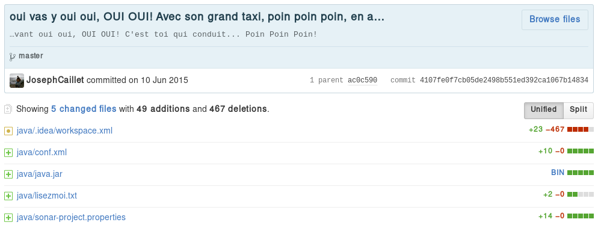
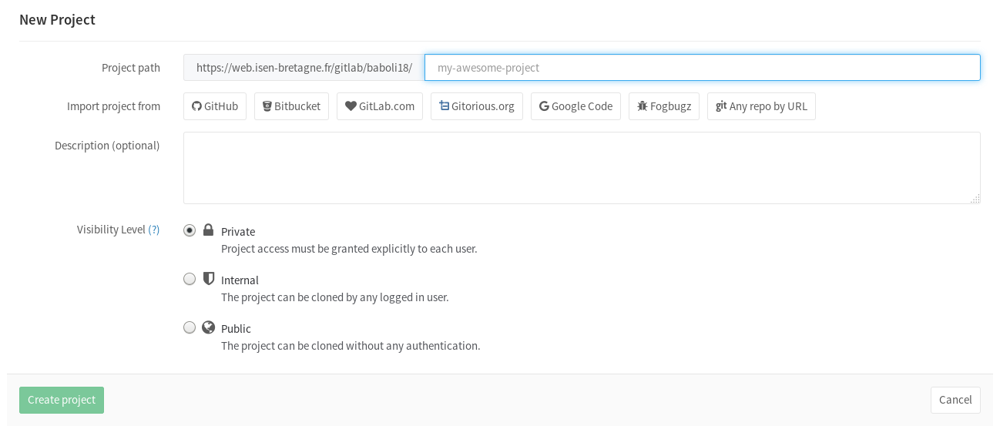
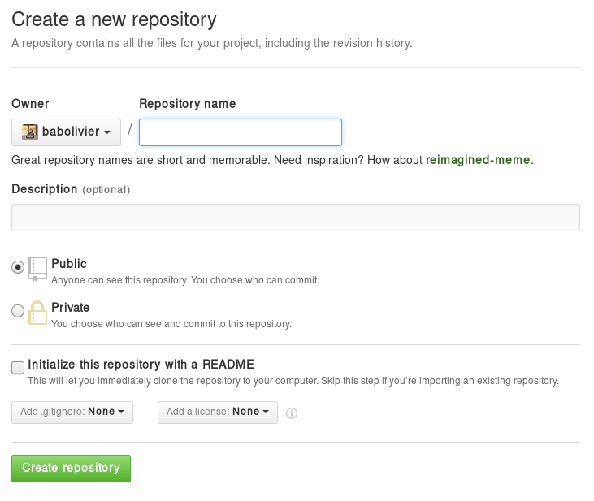
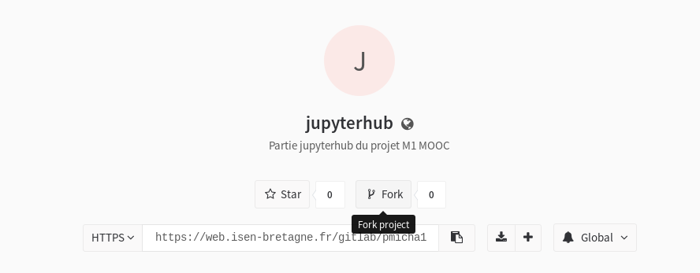
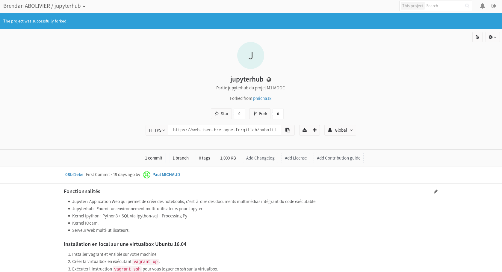
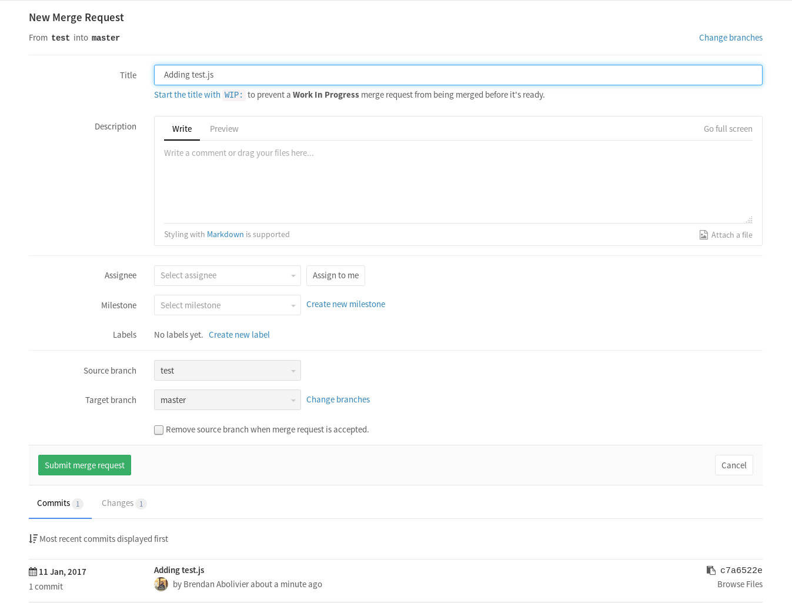
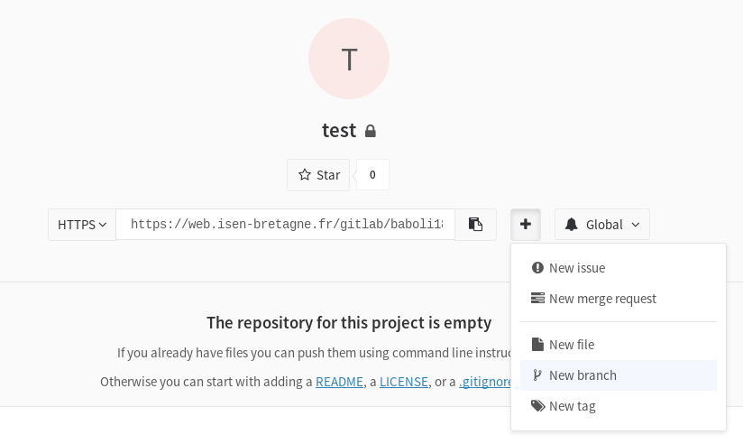

# Introduction à Git
<!-- .element: class="plain" style="height: 40%; width: auto; opacity: 0.8;" -->


## Who am I?

<!-- .element: class="plain" width="300px" -->

**Brendan Abolivier**

M1 Télécoms et Réseaux

[@BrenAbolivier](https://twitter.com/BrenAbolivier)


## Git: WTF?

* Travail collaboratif
* Gestion de version
	- Trace de tous les changements
	- "Voyage dans le temps"


## Installer

* Ubuntu : `sudo apt-get install git`
* Archlinux : `sudo pacman -S git`
* Windows : https://git-scm.com/download/win


## Organisation du cours

* Notions théoriques
* Mises en pratique
* Démos

--------------------

# Quelques notions

--------------------

# Local / serveur
<!-- .slide: data-background="assets/connection.gif" -->

Deux utilisations distinctes


## Local

*Garder une trace de toutes ses modifications*

Utile pour :

* Travailler hors ligne
* Garder une trace d'un état stable
* Revenir en arrière sur un mauvais travail
* ...


## Local : Je travaille où ?

Sur mon ordinateur !


## Serveur

*Travailler en équipe*

Utile pour :

* Développer un projet à plusieurs
* Garder une sauvegarde de son travail en ligne
* Publier les sources de son projet
* ...


## Serveur : Je travaille où ?

Sur l'infrastructure d'un hébergeur

* GitHub (https://github.com/)
* GitLab (https://gitlab.com/)

Sur ma propre infrastructure

* GitLab (https://gitlab.com/)
* Gitea (https://gitea.io/)
* SSH
* ...


## Serveur : Le push-pull

* Push : J'envoie mes modifications
* Pull : Je récupère des modifications

--------------------

# Dépôts

<!-- .slide: data-background="assets/cnh-home.gif" -->


## L'emplacement de votre projet

Sur le serveur, et en local


## En local

*Versionner* son projet


## Sur le serveur

Copie du projet au moment du *push*

--------------------

# Commits

<!-- .slide: data-background="assets/bttf.gif" -->


## Repères

Trace datée du moindre changement dans le projet




## Les commits, ça s'empile


--------------------

## En résumé

* Mon projet est à deux endroits à la fois :
	- Sur **mon ordinateur**
	- Sur **un serveur**
* Il se trouve dans un **dépôt**
* Je décris mes modifications dans un **commit**
* J'envoie mes modifications sur le serveur avec un **push** (je **pousse** mes modifications)
* Je récupère les modifications d'un autre depuis le serveur avec un **pull** (je **tire** les modifications)

--------------------

# En pratique


## Création d'un dépôt

Ça se fait côté serveur




## (GitHub)

 <!-- .element: width="60%" -->


## La ligne de commande Git

Configuration initiale

```bash
git config --global user.name "Brendan Abolivier"
git config --global user.email "contact@brendanabolivier.com"
```
<!-- .element: style="font-size:65%;" -->


## Récupération du dépôt en local

```bash
git clone https://web.isen-bretagne.fr/gitlab/baboli18/test.git
``` 
<!-- .element: style="font-size:62%;text-align:center" -->

Ici, l'adresse de mon dépôt est https://web.isen-bretagne.fr/gitlab/baboli18/test.git


## État des modifications

Voir les fichiers modifiés/ajoutés/supprimés

```plain
$ git status
Sur la branche master
Votre branche est en avance sur 'origin/master' de 20 commits.
  (utilisez "git push" pour publier vos commits locaux)
Modifications qui ne seront pas validées :
  (utilisez "git add <fichier>..." pour mettre à jour ce qui sera validé)
  (utilisez "git checkout -- <fichier>..." pour annuler les modifications dans la copie de travail)

    modifié :         slides.md

aucune modification n'a été ajoutée à la validation (utilisez "git add" ou "git commit -a")
```
<!-- .element: class="hljs" -->

Voir les modifications dans les fichiers modifiés

```bash
git diff
```
<!-- .element: style="font-size:100%;" -->


## Envoi de modifications

Création du commit

```bash
git add [...]
git rm [...]
git commit -m "Mon super commit"
```
<!-- .element: style="font-size:100%;" -->

Envoi du commit

```bash
git push
```
<!-- .element: style="font-size:100%;" -->


## Fragmenter ses modifications

Création de plusieurs commits

```bash
git add app.js
git commit -m "Fonctionnalité X"
git rm obsolete.js
git commit -m "Suppression de obsolete"
```
<!-- .element: style="font-size:100%;" -->

Envoi
```bash
git push
```
<!-- .element: style="font-size:100%;" -->


## Récupérer des modifications

```bash
git pull
```
<!-- .element: style="font-size:100%;" -->


## Lister les modifications

```bash
git log
```
<!-- .element: style="font-size:100%;" -->


## Revenir à un commit précis

```bash
git checkout [hash du commit]
```
<!-- .element: style="font-size:100%;" -->


# Démo !

--------------------

# Les forks


Copie du dépôt à l'instant *t*





**Le fork se comporte comme un dépôt**




## Conventions

La plupart du temps, on gère son projet en suivant ces conventions :

* Pour contribuer à un projet, on *fork* son dépôt
* On intègre nos modifications sur une nouvelle branche
* On ouvre une *merge request* sur le dépôt d'origine

--------------------

# Les branches

Ton dépôt est un arbre

 <!-- .element: width="30%" -->


## Kékecé ?

* Branche initiale : *master*
* Généralement une copie à un moment ***t*** de *master* + changements
* On "tire une branche" pour :
	- Développer des fonctionnalités
	- Effectuer des relectures de code
	- Assurer la stabilité du projet


## Conventions

La plupart du temps, on gère son projet en suivant ces conventions :

* *master* : Branche principale du dépôt
* *dev* : Contient les développements en cours
* *feature/[...]* : Développement d'une fonctionnalité
* *fix/[...]* : Développement d'une correction de bug

Note : Seule *master* est créée automatiquement


## Passer d'une branche à l'autre

On demande la **fusion** d'une branche dans une autre

* GitLab : *Merge requests*
* GitHub : *Pull requests*

(mais en vrai, c'est la même chose) <!-- .element: class="fragment" -->


## Les merge requests

 <!-- .element: width="70%" -->


## Exemple

__Alice et Bob travaillent sur un projet, sur un dépôt de Bob.__

__Alice veut ajouter un formulaire au projet.__

0. Elle *fork* le dépôt
0. Elle crée la branche *feature/formulaire* sur son fork
0. Elle y développe le formulaire
0. Elle ouvre une merge request de *feature/formulaire* sur son fork vers *dev* sur le dépôt de Bob
0. Bob relit le code d'Alice et fusionne sa branche sur son dépôt

__Le formulaire d'Alice est maintenant dans *dev*__


## Le cas de *master*

* Branche principale du dépôt
* État **stable** du projet
	* N'importe qui doit pouvoir l'utiliser

__On fusionne dans *master* quand :__

* On sort une nouvelle version du projet
* On sort un correctif d'un bug critique


## Exemple, seconde partie

__Alice et Bob ont rajouté plusieurs fonctionnalités à leur projet.__

0. L'un.e des deux ouvre une merge request de *dev* vers *master*
0. Les deux relisent les changements depuis la dernière mise à jour de *master*
0. L'autre fusionne *dev* dans *master*

--------------------

## En résumé

Encore une fois, des conventions !

* Je travaille sur le dépôt d'un autre à l'aide d'un **fork**
* Je travaille sur une **branche** qui décrit ma modification
* Je demande l'ajout de mes changements via une **merge request**
* `master` fait référence à une version **stable** de mon projet

--------------------

# En pratique

--------------------

## Création de la branche

Côté serveur

<!-- .element: width="70%" -->


## Changement de branche

Récupération de la nouvelle branche

```bash
git fetch
```
<!-- .element: style="font-size:100%;" -->

Passage sur la nouvelle branche

```bash
git checkout [nom de la branche]
```
<!-- .element: style="font-size:100%;" -->


## Push sur la branche

```bash
git push --set-upstream origin [nom de la branche]
```
<!-- .element: style="font-size:80%;" -->

la première fois, puis

```bash
git push
```
<!-- .element: style="font-size:80%;" -->

les fois suivantes


# Démo !

--------------------

# Aller plus loin


## Annuler des changements (hors commit)

```bash
git checkout [fichier]
```
<!-- .element: style="font-size:100%;" -->


## Annuler un commit

```bash
git revert [commit]
```
<!-- .element: style="font-size:100%;" -->

On peut récupérer le hash du commit avec `git log`


## Annuler un commit relativement

**Exemple : Annuler les deux derniers commits**

```bash
git revert HEAD~2
```
<!-- .element: style="font-size:100%;" -->

(fonctionne aussi avec `git checkout`)

--------------------

# Encore plus loin


## Intégration continue

* Travis (https://travis-ci.org/)
* Gitlab CI (https://about.gitlab.com/gitlab-ci/)

Lancement des tests unitaires à chaque push et *merge request*


## Mise en production automatisée

**Exemple : Caddy (et son module `git`)**

Mettre des modifications en production avec un push

--------------------

## Merci de votre attention !

**Questions ?**

<brendan.abolivier@isen-ouest.yncrea.fr>