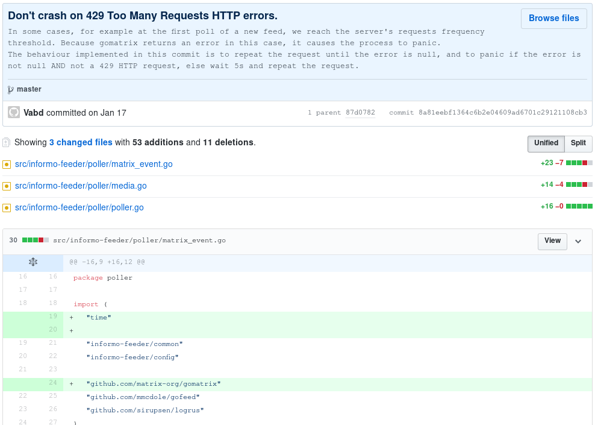

# Introduction à Git
<!-- .element: class="plain" style="height: 40%; width: auto; opacity: 0.8;" -->


## Who am I?

<!-- .element: class="plain" width="300px" -->

**Brendan Abolivier**

M1 Télécoms et Réseaux

[@BrenAbolivier](https://twitter.com/BrenAbolivier)


## Git: WTF?

* Travail collaboratif
* Gestion de version
	- Trace de tous les changements
	- "Voyage dans le temps"

--------------------

# Quelques notions

--------------------

# Serveur / local
<!-- .slide: data-background="assets/connection.gif" -->

Deux utilisations distinctes


## Local

*Tenir compte de toutes ses modifications*

Utile pour :

* Travailler hors ligne
* Garder une trace d'un état stable
* Revenir en arrière sur un mauvais travail
* ...


## Local : Je travaille où ?

Sur mon ordinateur !


## Serveur

*Travailler en équipe*

Utile pour :

* Développer un projet à plusieurs
* Garder une sauvegarde de son travail en ligne
* Publier son projet (libre)
* ...


## Serveur : Je travaille où ?

Sur l'infrastructure d'un hébergeur

* GitHub (https://github.com/)
* GitLab (https://gitlab.com/)

Sur ma propre infrastructure

* GitLab (https://gitlab.com/)
* Gitea (https://gitea.io/)
* SSH
* ...


## Serveur : Le push-pull

* Push : J'envoie mes modifications
* Pull : Je récupère des modifications

--------------------

# Dépôts

<!-- .slide: data-background="assets/cnh-home.gif" -->


## L'emplacement de votre projet

* Se situe sur le serveur
* Contient toutes les ressources du projet
* "Lieu" de consultation et de modification

--------------------

# Commits

<!-- .slide: data-background="assets/bttf.gif" -->


## Repères

Trace datée du moindre changement dans le projet




## Les commits, ça s'empile


--------------------

## En résumé

* Mon projet est à deux endroits à la fois :
	- Sur **mon ordinateur**
	- Sur **un serveur**
* Il se trouve dans un **dépôt** (sur le serveur)
* Je décris mes modifications dans un **commit**
* J'envoie mes modifications sur le serveur avec un **push** (je **pousse** mes modifications)
* Je récupère les modifications d'un autre depuis le serveur avec un **pull** (je **tire** les modifications)

--------------------

# En pratique


## Création d'un dépôt

Ça se fait côté serveur


## (GitHub)

 <!-- .element: width="60%" -->


## Récupération du dépôt en local

```
git clone https://web.isen-bretagne.fr/gitlab/baboli18/test.git
``` 
<!-- .element: style="font-size:62%;text-align:center" -->


## Envoi de modifications

Création du commit

```bash
git add [...]
git rm [...]
git commit -m "Mon super commit"
```
<!-- .element: style="font-size:100%;" -->

Envoi du commit

```bash
git push
```
<!-- .element: style="font-size:100%;" -->


## Fragmenter ses modifications

Création de plusieurs commits

```bash
git add app.js
git commit -m "Fonctionnalité X"
git rm obsolete.js
git commit -m "Suppression de obsolete"
```
<!-- .element: style="font-size:100%;" -->


Envoi
```bash
git push
```
<!-- .element: style="font-size:100%;" -->